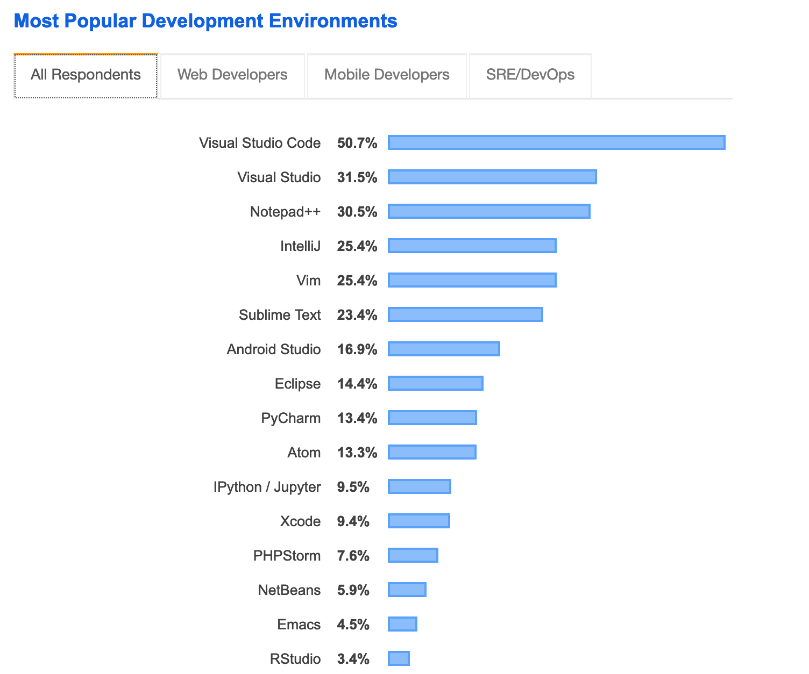

# Section 2: Make yourself more comfortable

## Python virtual environments

Why we need the virtual environments:

- Different packages have different version requirement of their dependence
- Do not have the permission to change the host python environment


Best ready-to-use tools to make environment setup:

**venv**

Build-in virtual environment package `venv` , it is the alternative of the old `pyenv` package.

```shell
# For python3 (>3.3)
$ python3 -m venv test1  # Debian-based linux may used python3-venv directly
$ source test1/bin/activate 
$ deactivate #to quit this virtual environment
#> Windows users
$ test1\Scripts\activate.bat


(test1) $ python
Python 3.8.1 (default, Jan  8 2020, 16:15:59)
[Clang 4.0.1 (tags/RELEASE_401/final)] :: Anaconda, Inc. on darwin
Type "help", "copyright", "credits" or "license" for more information.
>>> import sys
>>> sys.path
['', ..., '~/test1/lib/python3.8/site-packages']

$ which pip
~/test1/bin/pip
$ pip install
```


**virtualenv**

`virtualenv` is much versatile than the standard library `venv`. In general, the `venv` can be take as a subset of 'virtualenv'. 

The most advantage of `virtualenv` is that it can create a virtual environment with different python version. For example, you can create python2 host environment using virtualenv in python3, but you should have python2 installed locally. 

Different from `venv`, you need install the `virtualenv` package firstly.

```shell
$ python3 -m pip install virtualenv
...
Could not install packages due to an EnvironmentError: [Errno 13] Permission denied: '/usr/local/lib/python3.7/site-packages/appdirs.py'
Consider using the `--user` option or check the permissions.

$ python3 -m pip install --user virtualenv

# create a virtual environment in test2 directory
$ python3 -m virtualenv test2

# create a virtualenv with a different python version
$ which python2
$ python3 -m virtualenv --python=/usr/bin/python2 test3
```


**conda**

`conda = pip + virtualenv`

`conda` is written in python, but it can be used to create a totally isolated python environment and install python packages. It also support to install C or R packages as well.

```shell
$ conda list       # list the package in current conda environment
...
$ conda env list   # list all your conda environments
# conda environments:
#
base                  *  /Users/username/miniconda3
astro                    /Users/username/miniconda3/envs/astro
py2                      /Users/username/miniconda3/envs/py2
py3                      /Users/username/miniconda3/envs/py3

$ conda create -n py3 python=python=3.8.1
$ conda activate py3
(py3) $ conda install six   
...
$ conda list
$ pip list
$ conda deactivate
```


> Before run any `pip` or `python`, try 
>
> ```shell
> $ which python                # for linux/macos
> < where python                # for windows
> 
> $ python -m site              # for global site-packages
> $ python -m site --user-site  # where Python installs your local packages
> ```
>
> To confirm beforehand that you are installing the packages into the appropriate environment 

See more comparison between [different virtual environment tools](https://stackoverflow.com/questions/1534210/use-different-python-version-with-virtualenv/39713544#39713544)


## Ipython

Enhanced shell for interactive python


## Jupyter and JupyterLab

Jupyter (Jupyter notebook) is a web-based, interactive python development environment

JupyterLab: the next generation notebook interface

Jupyterhub: A multi-user version of the notebook designed for companies, classrooms and research labs


Try Jupyter and JupyterLab [online](https://jupyter.org/)


## Anaconda

Platform of Data Science or a pack of packages for Python users

Anaconda = `conda` + a bunch of packages (mainly python package)


## IDE

Pycharm, VisualStudio, VS Code, Atom, sublime, Vim, Emacs

In this section, I will introduce each IDE briefly and list some configurations and extensions.

From [stack overflow 2019 developer survey](https://insights.stackoverflow.com/survey/2019#technology-_-most-popular-development-environments)


